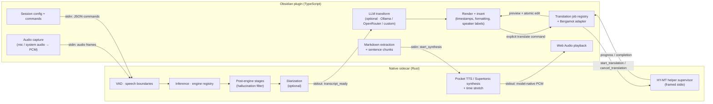
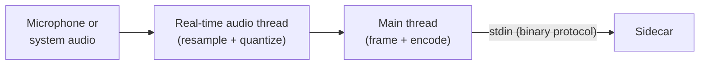
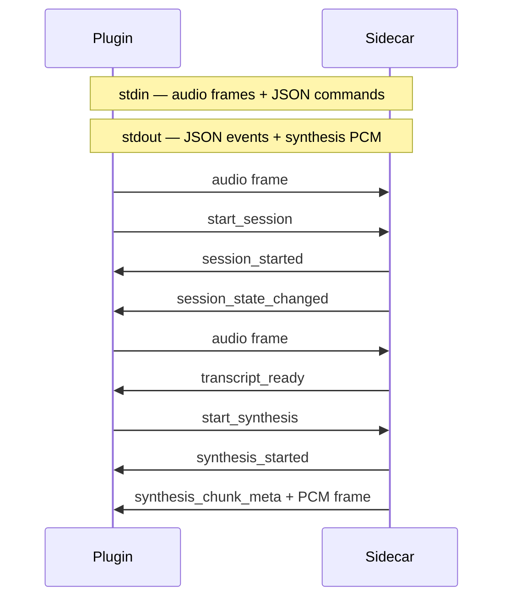
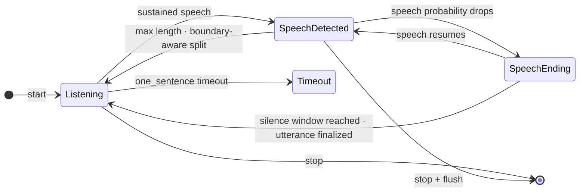
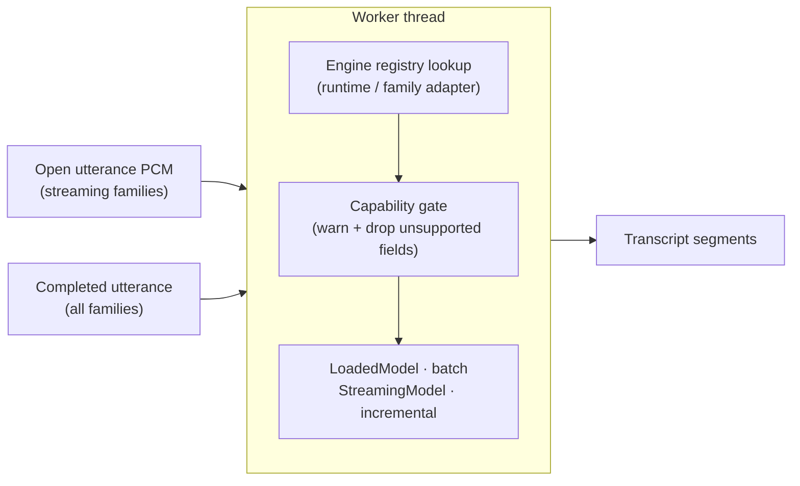
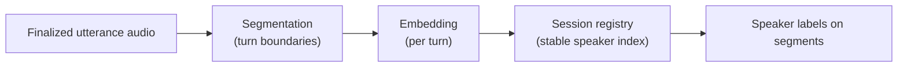

# System Architecture

Speech Kit is an Obsidian plugin that handles voice and language workflows
entirely on-device. Dictation audio crosses a binary protocol into a native
Rust sidecar and returns as text. Read-aloud text takes the inverse path and
returns as audio for playback in Obsidian. Firefox translation runs inside an
isolated WebAssembly worker; Tencent HY-MT 2 uses a packaged native helper.

The split is deliberate:

- **The plugin (TypeScript, `src/`)** owns Obsidian UX — capture and playback,
  settings, orchestration, Markdown extraction, local translation, the
  optional LLM transform, rendering, and editor insertion.
- **The sidecar (Rust, `native/`)** owns local speech inference — the complete
  audio-to-text pipeline plus text-to-audio synthesis and speed processing.

The plugin and sidecar talk over a single framed byte stream on the sidecar's
stdin/stdout. Dictation audio frames and JSON commands share stdin; JSON events
and read-aloud PCM frames come back on stdout. `transcript_ready` carries revisioned text. Batch families emit one
final revision per utterance; streaming families can emit changed partial
revisions before the final. LLM transforms and editor rendering remain plugin
concerns.

---

## Pipeline Stages

### Stage 1: Audio Capture

Captures raw audio, resamples to 16 kHz, quantizes to 16-bit PCM, and packages
it into fixed 640-byte frames at 50 fps.

- **Microphone** capture runs in the plugin via the Web Audio API. An
  `AudioWorklet` runs on a dedicated real-time thread; `PcmFrameProcessor` does
  linear-interpolation resampling from the browser's native rate (44.1/48 kHz)
  down to 16 kHz.
- **Local audio files** are selected through a renderer-local file input,
  encoded-size checked before reading, and decoded by the running Obsidian
  Web Audio implementation. A conservative 192 MiB / 30-minute decoded budget
  (plus the selected model's own duration limit) is enforced before the sidecar
  session starts. Decoded channels are sliced, mixed, resampled, and written
  with sidecar-queue backpressure; the bytes never leave the local stdin pipe.
  The accepted-format contract is successful decode by the active desktop
  runtime, not a promised extension-to-codec mapping.
- **System audio** (this computer's output) is captured natively by the sidecar
  on Windows (WASAPI loopback), Linux (the default PulseAudio/PipeWire monitor),
  and macOS 14.2+ (CoreAudio process taps attached to a private aggregate
  device). It is optional and graceful — if the platform's audio stack is
  unavailable the source is simply hidden.

**PCM format** (shared constants, identical in TS and Rust):

| Parameter | Value |
|-----------|-------|
| Sample rate | 16,000 Hz |
| Channels | 1 (mono) |
| Bit depth | 16-bit signed LE (Int16) |
| Frame duration | 20 ms |
| Samples per frame | 320 |
| Bytes per frame | 640 |

This stage is effectively real-time for microphone capture and never a
bottleneck (~3-6 ms AudioContext latency plus 20 ms frame accumulation).

#### Local audio-file workflow

The **Transcribe local audio file** command is deliberately separate from live
microphone capture. It is available only in the Obsidian desktop app and uses a
renderer-local `File`; there is no URL fetch, upload, or remote fallback.

The file picker is the first `MediaSource` adapter. It emits provider-neutral
plan/progress/ready events and returns a short-lived `MediaLease` implemented by
`LocalMediaLease`, with an opaque pull-driven `ReadableStream` and typed
provenance. Interactive acquisition opens the picker once and does not retain an
abandoned `File` or expose a local token/reference API. The lease is released
immediately after decode/VAD/ASR transcript projection and before optional
post-completion AI work, with an idempotent cleanup promise covering success,
failure, cancellation, and disposal. The ASR, renderer, and LLM layers never
receive a provider URL, path, credential, subprocess, or remote response body.
Local-file acquisition remains the only adapter in this release; referenced
provider sources arrive in the next stacked PR.

The media controller owns the provider-neutral sequence: acquire → local decode
→ the existing VAD/batch-ASR `Session` → timestamps, diarization, and smart
formatting → safe editor insertion. Progress exposes `acquire`, `decode`,
`transcribe`, `format`, `AI processing`, and `insert` independently. Existing
encoded/decoded budgets, bounded frame work, sidecar drain/backpressure,
speech-lease quarantine, exact target ownership, retry, and localization
behavior are unchanged.

When `mediaLlmProcessing` is explicitly enabled, a dedicated media LLM
coordinator preflights provider/model/key/base-URL readiness before expensive
local transcription, then re-reads settings at post-completion and before
application. It uses the existing configured provider, active preset, and
provider/model/data-egress disclosure. The provider receives only the recorded
transcript text and explicitly bounded current-note context—never media, a
media path/name, source URL, provenance, cookies, or tokens. The raw media
range remains the source of truth. A preview/explicit confirmation is required
before replace or additive output; empty/failure leaves raw text and reports
actionable feedback. Disabling media processing or all LLM features aborts an
in-flight provider request. A user edit latches the range and wins over pending
AI output. Replacement is one undoable editor operation, raw recovery restores
the pre-AI range, and additive outputs leave the raw range and citation boundary
untouched. Custom OpenAI-compatible chat uses a CORS-free Node HTTP(S) stream
with bounded response reads, early Content-Length rejection, timeout, and
AbortSignal propagation; model discovery retains the existing requestUrl probe.
The setting defaults to off, so file behavior is unchanged unless the user opts
in.

1. The command captures the exact active/fallback Markdown target and validates
   a validated non-streaming speech-to-text model, configured dictation language,
   speech lease, and absence of conflicting capture. It opens the picker only
   after this preflight.
2. The same target, model selection, and language are revalidated after the
   picker and again immediately before `start_session`. A target that merely
   still has *some* Markdown editor open is not considered the same target: the
   `(file, CodeMirror view, target kind)` identity must match.
3. The selected file is encoded-size checked before its bytes are read. The
   encoded read, Web Audio decode wrapper, frame source, and drain-aware sidecar
   write share one `AbortSignal`. Every created `AudioContext` is closed on
   success, failure, and cancellation. Cancellation before `start_session` is
   written prevents issuance of that command and never sends a cancellation that
   could respawn the sidecar.
4. A whole-buffer decode is accepted only within these conservative guardrails:

   | Guardrail | Limit |
   |---|---:|
   | Encoded `File.size` | 64 MiB |
   | Logical decoded PCM (`channels × frames × 4`) | 192 MiB |
   | Decoded duration | 30 minutes |
   | Selected model duration | Model's shorter declared limit |

   These checks happen immediately after decode and before any sidecar session.
   They are product guardrails, not a promise that Web Audio's transient native
   decoder allocations are zero. The plugin does not create a second whole-file
   mono buffer: channel slices are mixed, resampled, and released incrementally.
5. Each output frame is exactly 16 kHz mono signed PCM16, 320 samples / 640
   bytes. `SidecarProcess.writeAudioFrame` is required and waits for Node stdin
   `drain` when a write returns false. The source awaits that bounded write;
   `falling_behind` and `saturated` queue tiers pause it, while
   `utterance_queue_overload` and the finite backpressure deadline abort the
   source and issue native `cancel_session`, never graceful stop.
6. Normal completion requests `stop_session` after all accepted frames. The
   `ManagedAudioFileSession` lifecycle owns start issuance, start acknowledgement,
   stop/cancel requests, feedback arbitration, and lease disposition. A local
   projection adapter tracks only insertion promises; it never waits for native
   cancellation while a transcript event is being inserted.
7. `transcript_ready` is projected through the existing `Session` surface. A
   complete final revision is one atomic insertion; a rejected projection
   reports actionable copy and starts cancellation without deadlocking the
   transcript drain. The session is disposed only after its projection work and
   editor resources finish.
8. A failed or unacknowledged cancellation retains the speech lease in quarantine
   while the sidecar process remains alive. Only a correlated `session_stopped`
   result, a `no_active_session` acknowledgement, or an observed forced process
   exit releases that lease. This keeps mutations blocked without allowing a
   late native session to overlap maintenance. Terminal workflow errors clear
   local state and are retryable through a new command invocation.

The file workflow keeps the existing microphone LLM behavior separate. With
`mediaLlmProcessing` off, media transcription never invokes a provider and
retains the existing raw insertion behavior. With it on, only the completed
media transcript text is considered by the explicit, confirmed media transform;
audio bytes never cross the local sidecar pipe or an LLM request.

#### Verification boundary

Generated WAV fixtures exercise stereo channel mixing, real linear resampling,
fixed frame output, encoded/decoded budgets, cancellation, and backpressure.
Fake platform decoders stand in for Electron's codec implementation. Manual
real-Electron codec/file-picker smoke testing and real Node stream backpressure
against a running sidecar remain release verification tasks; the TypeScript
suite cannot prove those platform integrations.

---

### Stage 2: Binary Protocol Transport

The sidecar is spawned as a subprocess of Obsidian (`child_process.spawn`,
`stdio: 'pipe'`). A custom 5-byte framing header (1 byte kind + 4-byte LE length
+ payload) multiplexes JSON and raw audio on one bidirectional stream — no HTTP,
no WebSocket, no IPC library. `FramedMessageParser` (TS) and `read_frame` (Rust)
reassemble frames across chunk boundaries.

- `stdin` (TS → Rust): audio frames (`0x02`) and JSON command frames (`0x01`).
- `stdout` (Rust → TS): JSON event frames (`0x01`) and read-aloud PCM16LE
  frames (`0x03`). A synthesis frame starts with little-endian
  `u32 synthesisId` + `u32 seq`, followed by mono PCM.

**Commands (TS → Rust):**

| Command | Purpose |
|---------|---------|
| `health` | Liveness ping |
| `get_system_info` | Enumerate compiled runtimes and family adapters with static capabilities |
| `start_session` | Begin transcription (model, mode, sessionId, options) |
| `stop_session` | Graceful stop (drain pending transcriptions) |
| `cancel_session` | Immediate cancel (discard pending) |
| `context_response` | Reply to a `context_request` with the plugin-assembled context window |
| `shutdown` | Hard process exit; call `stop_session` first to drain |
| `get_model_store` | Query the model store path |
| `list_model_catalog` | Fetch the built-in model catalog |
| `list_installed_models` | List locally installed models |
| `probe_model_selection` | Check whether a model selection is usable |
| `install_model` | Start a model download + install |
| `cancel_model_install` | Cancel a pending install |
| `remove_model` | Delete an installed model |
| `start_synthesis` | Start read aloud for ordered text chunks, model, voice, language, and speed |
| `cancel_synthesis` | Cancel the matching synthesis session immediately |
| `synthesis_playback_position` | Acknowledge the last played chunk for audio-ahead flow control |

**Events (Rust → TS):**

| Event | Purpose |
|-------|---------|
| `health_ok` | Health reply with version |
| `system_info` | Compiled runtimes + adapters with declared capabilities |
| `session_started` | Session confirmed active |
| `session_state_changed` | State-machine transition |
| `audio_level` | Periodic input level for the meter |
| `transcript_ready` | Transcript revision: `isFinal`, monotonic `revision`, segments, timing, `stageResults[]`, and `warnings[]` |
| `transcription_queue_changed` | Back-pressure queue depth changed |
| `context_request` | Sidecar asks the plugin for context for the next utterance |
| `session_stopped` | Session ended, with reason |
| `warning` | Non-fatal warning |
| `error` | Fatal error |
| `model_store` | Model store path info |
| `model_catalog` | Full catalog payload |
| `installed_models` | Installed model list |
| `model_probe_result` | Availability check + merged capabilities for the selection |
| `model_install_update` | Install progress |
| `model_removed` | Deletion confirmation |
| `synthesis_started` | Synthesis accepted, including the output sample rate |
| `synthesis_chunk_meta` | Sequence, source range, and duration for the following PCM frame |
| `synthesis_complete` | All synthesis audio has been produced |
| `synthesis_error` | Typed failure for one synthesis session |

Transport latency is sub-millisecond per frame; the main loop polls at 10 ms.

---

### Stage 3: Speech Boundary Detection

Receives 20 ms PCM frames, runs voice-activity detection on each, and uses a
state machine to detect speech boundaries and package completed utterances.

- **Silero VAD** (ONNX via the `ort` crate) returns a speech probability
  (0.0–1.0) per 512-sample (32 ms) window. The detector buffers 20 ms pipeline
  frames, carries 64 samples of context forward, and threads a `[2, 1, 128]` RNN
  state across inferences.
- A **preset-driven state machine** (`session.rs`) owns the tuning. The user
  picks a named speaking style; hysteresis (the end threshold sits 0.15 below the
  start threshold, floored at 0.05) plus a min-speech gate reject transients, and
  a pending-end timer fires finalization.

**Speaking-style presets** (Rust-authoritative):

| Preset | `speech_threshold` | `min_speech_frames` | `silence_end_frames` |
|---|---|---|---|
| Responsive | 0.40 | 3 (60 ms) | 20 (400 ms) |
| Balanced (default) | 0.50 | 5 (100 ms) | 50 (1000 ms) |
| Patient | 0.55 | 6 (120 ms) | 100 (2000 ms) |

The silence windows track industry streaming-dictation norms: 400 ms
(AssemblyAI Streaming v2's legacy end-of-turn), 1000 ms (AssemblyAI
Universal-Streaming / Deepgram end-of-speech), and 2000 ms (near Azure dictation
territory for long pauses).

**Finalization paths:**
1. **Natural end** — probability drops below the negative threshold; once the
   silence gap reaches `silence_end_frames`, the utterance is trimmed and
   finalized.
2. **Boundary-aware split** — at the 30 s hard cap (`MAX_UTTERANCE_FRAMES`), the
   session cuts at the most recent silence boundary if one is recent enough, else
   falls back to a hard cut, and keeps the tail running.
3. **Graceful stop** — on user stop, any pending utterance is emitted before the
   session stops.

Each finalized utterance carries `VoiceActivityEvidence` (audio/speech bounds,
voiced/unvoiced duration, mean/max probability) derived from the same frames sent
to inference. The per-frame Silero trace also reaches downstream stages as a
borrowed slice, so processors that need sub-utterance resolution can compute
per-segment voiced fraction without re-running VAD.

For a streaming family, the session also forwards PCM while the VAD utterance
is open. VAD still owns the boundary and authoritative final clip. If trailing
silence or a boundary-aware split makes the live PCM differ from that clip, the
worker resets and replays the final clip before final decode.

The perceived end-of-speech delay is the preset's silence window
(400–2000 ms); Silero inference itself is ~1 ms amortised per 20 ms frame.

---

### Stage 4: Inference

Looks up the family adapter for the session's `(runtimeId, familyId)`, drops any
request fields the adapter doesn't support (emitting `RequestWarning[]`), runs
the model, and produces timestamped text segments.

**Three-layer engine abstraction:**

| Layer | Trait | Owns |
|---|---|---|
| Runtime | `Runtime` | Execution framework: accelerator probe, supported model formats |
| Family adapter | `ModelFamilyAdapter` | Model shape: graph I/O, tokenizer, prompt tokens, audio limits, probe rules |
| Loaded batch model | `LoadedModel` | Per-session batch inference state; `transcribe(&TranscriptionRequest)` |
| Loaded streaming model | `StreamingModel` | Per-utterance PCM acceptance, partial decode, final decode, reset |
| Loaded synthesis model | `SynthesisModel` | Text + voice to mono PCM for read aloud |

`EngineRegistry::build()` is the single registration site. Worker dispatch uses
`adapter.load → loaded.transcribe` for batch families and
`adapter.load_streaming → accept_audio / partial / finalize_utterance` for a
streaming family.
Pocket TTS and Supertonic use
`adapter.load_synthesis → synthesis_model.synthesize` on a separate synthesis
worker, so they do not enter the dictation session pipeline.
Capabilities reach the plugin two ways: inventory (`system_info`) and
per-selection merge (`model_probe_result.mergedCapabilities`). `whisper_cpp`
advertises the Metal or CUDA backend compiled into the sidecar; this is a
configured route, not observation of the backend after model load. The plugin
separately checks NVIDIA compatibility before recommending the CUDA sidecar.
The production `onnx_runtime` integration is CPU-only. The tested ONNX ASR
exports were slower or unsafe with the generic CUDA execution provider; other
families remain on CPU without an unverified acceleration claim.

**Compiled runtimes and adapters:**

| Runtime | Crate | Model format | Adapter |
|---|---|---|---|
| `whisper_cpp` | whisper-rs (whisper.cpp) | GGML `.bin` | `whisper` |
| `onnx_runtime` | ort (ONNX Runtime) | ONNX / ORT | `cohere_transcribe`, `moonshine`, `nemotron_asr`, `pocket_tts`, `supertonic` |

Cargo features: `engine-whisper`, `engine-cohere-transcribe`,
`engine-moonshine`, `engine-nemotron-asr`, `engine-pocket-tts`,
`engine-supertonic`, `gpu-metal`, `gpu-cuda`. A missing
`(runtimeId, familyId)` pair surfaces as an `unsupported_engine` error rather
than a silent failure.

**Worker behavior:**
- A dedicated thread holding `Arc<EngineRegistry>`, communicating over `mpsc`
  channels; all inference is synchronous and blocking on that thread.
- Whisper runs greedy decoding in the exact model's selected language, with
  translation disabled and `use_gpu`/`flash_attn` from the acceleration config. The model context persists across utterances and
  reloads only on a path or GPU-config change.
- Moonshine keeps frontend, encoder, adapter, cross-attention, and decoder KV
  state for the open utterance. It attempts a changed-text partial every 500 ms;
  the single worker thread guarantees one decode in flight, and the wall-time
  gate drops catch-up partials while preserving all PCM for the next decode.
- Nemotron keeps the pinned encoder's channel/time caches and RNNT predictor
  states across 560 ms chunks. The session language selects the pinned graph's
  verified prompt index, and the adapter resets all
  graph state on finalization or inference failure.
- Partials carry only the engine stage outcome. Finals run the normal post-engine
  chain and receive a revision greater than every emitted partial.
- Back-pressure: finalized utterances queue while inference is in flight; queue
  tiers are reported, and the session stops at a hard cap rather than silently
  dropping audio.
- Panic safety: `catch_unwind` wraps model load and inference; panics become
  `error` events instead of crashing the sidecar.

**Available models:**

| Model | Runtime · Family | Quant | Size | Notes |
|-------|--------|-------|------|-------|
| Whisper Tiny EN | `whisper_cpp` · `whisper` | Q8_0 | 42 MB | Fastest, lowest quality |
| Whisper Base EN | `whisper_cpp` · `whisper` | Q8_0 | 78 MB | |
| Whisper Small EN | `whisper_cpp` · `whisper` | Q5_1 | 181 MB | Balanced |
| Whisper Medium EN | `whisper_cpp` · `whisper` | Q5_0 | 514 MB | |
| Whisper Large V3 Turbo | `whisper_cpp` · `whisper` | Q8_0 | 834 MB | Best with GPU |
| Cohere Transcribe FP16 | `onnx_runtime` · `cohere_transcribe` | FP16 | 3.8 GB | 2B params |
| Cohere Transcribe INT8 | `onnx_runtime` · `cohere_transcribe` | INT8 | 2.9 GB | |
| Cohere Transcribe Q4 | `onnx_runtime` · `cohere_transcribe` | Q4 | 2.0 GB | |
| Moonshine Tiny | `onnx_runtime` · `moonshine` | Quantized | 49 MB | Streaming (live), 34M params |
| Moonshine Small | `onnx_runtime` · `moonshine` | Quantized | 157 MB | Streaming (live), balanced, 123M params |
| Moonshine Medium | `onnx_runtime` · `moonshine` | Quantized | 289 MB | Streaming (live), 245M params |
| Nemotron 3.5 ASR 560 ms | `onnx_runtime` · `nemotron_asr` | INT8 | 651 MB | Multilingual streaming |
| Supertonic 3 | `onnx_runtime` · `supertonic` | ONNX | 398 MB | Read aloud in eight app languages, 10 voices |
| Firefox Translations | `bergamot_wasm` · `firefox_translations` | Bergamot | ~5 MB runtime + 20–67 MB per direction | 96 released English-anchored directions, downloaded on demand |

Moonshine models are streaming (live-dictation) entries in the managed catalog,
installed through Manage Models like any other model. Each is a multi-file ORT
asset set (frontend, encoder, adapter, cross/decoder KV, streaming config, and
tokenizer) fetched from Moonshine AI and verified against pinned sizes and
SHA-256 hashes. They are English-only and do not apply speaker labels. See
[`docs/guides/moonshine-live-testing.md`](guides/moonshine-live-testing.md) for
install and manual acceptance testing.

Nemotron 3.5 ASR is a separate managed entry; Moonshine Small
remains the recommended live-dictation default. Its encoder, decoder, joiner,
and tokenizer are pinned by revision, size, and SHA-256. The adapter supports
the 560 ms int8 export with verified manual and automatic language prompts. See
[`docs/specs/nemotron-asr-stage-a.md`](specs/nemotron-asr-stage-a.md) for the
artifact, graph-contract, golden-oracle, and license record.

**Inference is the bottleneck.** Time depends on model size, hardware, and
utterance length, and is reported as `processing_duration_ms` on each transcript.
Typical for a ~3 s utterance: Whisper Tiny ~200-500 ms (CPU); Whisper Small
~1-3 s (CPU) or ~200-500 ms (Metal/CUDA); Large V3 Turbo ~2-5 s (Metal/CUDA). On
smaller models the user is usually still pausing when inference completes, so the
silence window hides most of the latency.

---

### Stage 5: Post-Engine Stages

After final inference, a chain of post-engine processors runs in canonical order
on the finalized transcript. Streaming partials bypass this chain entirely.
Each final stage may rewrite or drop segments but is validated against the prior
revision: it must not move timing boundaries, overlap segments, or run past the
utterance duration. A panicking stage is caught and recorded as
`Failed`; the chain continues. Every stage records a `StageOutcome`
(`Ok` / `Skipped` / `Failed` with revision and payload), and the full history
ships in `transcript_ready.stageResults[]`.

**Registered today:** the **hallucination filter** — a conservative filter that
drops whole hallucinated segments while preserving timing. Hard text artifacts
(empty text, punctuation-only output, known non-speech tags, caption/source
attributions) can drop on text alone; soft artifacts (courtesy endings, CTAs,
bare `you`, URL-like text) require corroborating model or VAD evidence. It
combines Whisper/Cohere decoder diagnostics with per-segment voiced fraction and
utterance-level VAD evidence. If nothing is dropped it records
`Skipped { reason: "no_hallucinations" }`.

`StageId::Punctuation` and `StageId::UserRules` exist as reserved identifiers but
have no registered processor yet.

---

### Stage 6: Diarization (optional)

When speaker diarization is enabled, it runs in the worker after the text stages,
on the finalized utterance's audio:

A single VAD utterance can contain more than one speaker, so segmentation finds
*where* speakers change, embedding + a session-scoped registry decide *who* they
are, and the worker aligns transcript segments to those turns. Speaker indices
stay stable across the session because turns reconcile by voice.

By default, a sufficiently distinct long turn may create another session
speaker. When `diarizationMaxSpeakers` is set and the registry reaches that
count, subsequent turns attach to the nearest existing centroid instead. This
prevents known two-person recordings from accumulating extra labels, at the
explicit cost of merging a real additional speaker if the configured limit is
too low.

All speaker data lives in memory for the session and is discarded when it ends —
no enrollment, no persisted voiceprints, no network. The bundled models are
`pyannote/segmentation-3.0` (MIT) and `wespeaker_en_voxceleb_resnet34_LM`
(CC-BY-4.0); see [THIRD_PARTY_NOTICES.md](../THIRD_PARTY_NOTICES.md).

Streaming sessions do not run diarization in this version. A requested
`diarizationEnabled` value is ignored and reported in the transcript's
capability warnings.

---

### Stage 7: Transform, Render, Insert (plugin)

The plugin consumes every accepted `transcript_ready` revision:

1. **LLM transform (optional, off by default).** Final revisions can be cleaned,
   rewritten, or summarized per utterance — or the whole session in batch —
   through Ollama, OpenRouter, or one user-configured OpenAI-compatible endpoint.
   A provider must be chosen explicitly. Routing either uses one provider for
   every transcript or sends transcripts above a configurable character
   threshold to a second provider; provider failures never trigger failover.
   Audio is never sent; only the transcript text and any note context you opt in
   to. Lives in `src/llm/`.

   Provider connections and routing policy are stored separately. The custom
   adapter uses a validated user-supplied base URL, optional bearer key from
   Obsidian Secret Storage, best-effort `GET /models` discovery, and
   `POST /chat/completions`; manual model IDs remain usable when discovery is
   unavailable. Provider/model choices are snapshotted when dictation starts,
   while disabling LLM features is a live kill switch that aborts in-flight
   cleanup and keeps the rest of that session raw.
2. **Render.** The transcript renderer (`src/transcript/renderer.ts`) applies the
   user's formatting (`smart` / `space` / `new_line` / `new_paragraph`), optional
   elapsed- or wall-clock timestamps, and speaker labels. Timestamp frequency can
   use fixed intervals, every engine segment or VAD phrase, or Smart paragraph
   breaks.
3. **Insert or revise.** The first revision lands at the dictation anchor;
   later revisions compare-and-swap the tracked utterance span. Non-final text
   has a theme-neutral provisional opacity decoration. A user edit latches the
   span, clears the decoration, and prevents all later model revisions from
   overwriting it. Final, latch, and session teardown all clear provisional
   state.

---

### Stage 8: Read Aloud

The read-aloud path is independent from microphone capture and transcription:

1. The plugin selects the active text scope, removes Markdown syntax, skips
   frontmatter/code/math, and sends ordered sentence chunks with source ranges.
2. The sidecar resolves a catalog model whose task is `tts`, loads its selected
   voice, passes the selected dictation language, synthesizes model-native mono
   audio (Pocket TTS at 24 kHz or Supertonic at 44.1 kHz), and applies
   pitch-preserving speed adjustment for the supported 0.75–2.0× range.
3. Chunk metadata and binary PCM frames share stdout. The plugin schedules them
   through Web Audio and reports each played sequence to bound synthesis to
   roughly 30 seconds of audio ahead.
4. Pause suspends the playback context; Stop cancels native synthesis and clears
   queued audio. Read aloud and dictation are mutually exclusive so playback
   cannot feed an active capture session.

The model catalog and settings keep independent `stt`, `translation`, and `tts`
selections.
Pocket TTS and Supertonic models and optional voices are downloaded on demand
and verified by their pinned size and SHA-256 before activation.

---

### Stage 9: Local Translation

Translation has one controller-owned job and a small adapter registry keyed by
the selected model runtime and family:

1. `TranslationController` captures a selection or whole-note snapshot.
2. A pure TypeScript segmentation pass protects Markdown structure, code,
   math, links, tags, frontmatter, and whitespace while extracting prose.
3. Firefox models run in a Blob-backed Web Worker. Tencent HY-MT 2 models send
   ordered text units to the sidecar, which supervises the sibling helper over
   bounded framed stdio.
4. HY-MT loads lazily, handles one inference job, remains warm for five idle
   minutes, and uses the GGUF's embedded chat template exactly once.
5. Closing the modal detaches it from the job; the translation status item can
   reopen active progress or a completed preview. Explicit Cancel stops work.
6. Marker restoration and a Markdown topology signature are validated per
   unit. Unsafe output keeps the original unit in a copyable partial preview;
   Replace and Insert below stay disabled. Note-writing also requires an
   unchanged source snapshot.

The sidecar catalog owns SHA-256-pinned installation and removal for both
engines. Translation support is either exact directed pairs or an all-to-all
language set. Note text never crosses the network; HY-MT protocol and logs do
not record source or translated text.

---

## Plugin Orchestration

### Listening Modes

| Mode | Behavior | Auto-stop |
|------|----------|-----------|
| `one_sentence` | Capture one utterance, transcribe, stop | Yes (first transcript or 10 s timeout) |
| `always_on` (default) | Continuous capture, transcribe every utterance | No (manual stop) |

### Ribbon States

The ribbon mic reflects the capture state: `idle` (click to start), `starting`,
`listening`, `speech_detected` (hearing speech), and `error`. Transcription
happens in the background without blocking capture, so there is no separate
"transcribing" ribbon state.

### Editor Target Ownership

A dictation session resolves the exact CodeMirror editor that owns its target
and, when possible, temporarily pins that Markdown leaf. The lease lasts until
accepted transcripts and optional batch cleanup finish, so ordinary navigation
opens elsewhere instead of displacing the note receiving text. User pin changes
always take precedence over plugin ownership.

If the exact target leaf closes or is replaced, the controller cancels the
session and discards later transcript events. If an external edit makes a
tracked insertion position unmappable, the note surface returns a typed terminal
outcome and clears plugin decorations rather than clamping or guessing a new
position. Both paths preserve the note and produce one actionable recovery
message.

### Settings

A representative slice of user-facing settings (full list and defaults in
`src/settings/plugin-settings.ts`):

| Setting | Default | Purpose |
|---------|---------|---------|
| `listeningMode` | `always_on` | Dictation trigger behavior |
| `speakingStyle` | `balanced` | VAD preset (Responsive / Balanced / Patient) |
| `selectedModel` | `null` | Active model selection |
| `accelerationPreference` | `auto` | GPU when available vs CPU-only |
| `includeSystemAudio` | `false` | Capture system output instead of the mic |
| `diarizationEnabled` | `false` | Label speakers (Speaker 1, 2, …) |
| `diarizationMaxSpeakers` | `null` | Optional positive cap on session-stable speaker labels; `null` detects automatically |
| `dictationAnchor` | `at_cursor` | Where transcript text lands (`at_cursor` / `end_of_note`) |
| `transcriptFormatting` | `smart` | How utterance boundaries render |
| `timestampsEnabled` | `false` | Render timestamps in the note |
| `timestampClock` | `elapsed` | `elapsed` session time vs `wallclock` |
| `timestampDensity` | `sparse` | `sparse` (interval), `every_utterance`, or `paragraph` |
| `llmPostprocessMode` | `off` | Microphone LLM transform: `off` / `per_utterance` / `batch` |
| `mediaLlmProcessing` | `false` | Explicit, confirmed batch text transform after local media transcription |
| `llmRoutingPolicy` | `null` | Fixed provider or optional transcript-size split |
| `llmProviderConfigurations` | Empty models | Ollama, OpenRouter, and OpenAI-compatible connection settings |
| `llmNetworkTimeoutSec` | `60` | OpenRouter and custom-endpoint request timeout |
| `sidecarRequestTimeoutSeconds` | `300` | Command/response timeout |
| `sidecarStartupTimeoutSeconds` | `4` | Health-check timeout on launch |
| `developerMode` | `false` | Verbose logging |

---

## Technology Reference

| Technology | Role in the system |
|------------|--------------------|
| **Obsidian Plugin API** | Host runtime: editor access, commands, settings, UI hooks |
| **Web Audio API / AudioWorklet** | Microphone capture and PCM frame production at 50 fps |
| **whisper-rs / whisper.cpp** | Primary engine; runs GGML-quantized Whisper on CPU, Metal, or CUDA |
| **ort (ONNX Runtime)** | Engine for Cohere Transcribe, Moonshine, and Nemotron; also runs Silero VAD and diarization models |
| **Silero VAD** | Speech probability per 32 ms window; drives boundary detection |
| **Node.js child_process** | Spawns and manages the Rust sidecar |
| **reqwest + sha2** | Downloads model files and verifies their SHA-256 |
| **Ollama / OpenRouter / OpenAI-compatible APIs** | Optional provider-selected text transformation on the plugin side |

## Where Things Live

- **Sidecar binary:** `.obsidian/plugins/local-dictation/bin/<variant>/`
  (`cpu`, `cuda`), installed by the plugin from the GitHub Release named in
  `sidecar-version.json`. Before publishing a plugin-only release, the tagged
  workflow verifies that this tag is published and carries the complete archive
  and checksum set, and that native/protocol compatibility inputs did not
  change. Plugin-only releases can therefore reuse an earlier sidecar without
  sending a new installation to a plugin-only tag.
- **Models:** outside the vault, in the user data directory, so they aren't
  duplicated per-vault:
  - Windows: `%LOCALAPPDATA%\obsidian-local-stt\models`
  - macOS: `~/Library/Application Support/obsidian-local-stt/models`
  - Linux: `~/.local/share/obsidian-local-stt/models`
